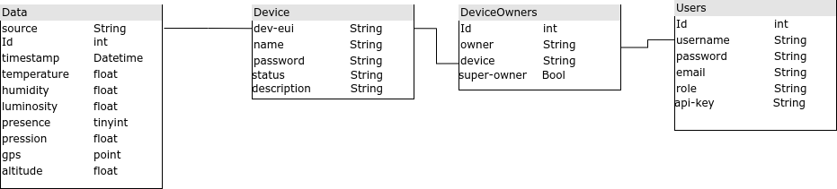

# Plateforme Web 

## Sommaire
--- Parametrage
--- Lancement de la plateforme
--- Utilisation de l'api
--- Structure des des dossiers
--- Explication des differentes parties
    --- Base de données
    --- Mqtt
    --- Interface
    --- Serveur Flask


## Parametrage

Le fichier config.conf permet de configurer le projet selon votre installation
```conf
db_name=your_db_name
SQL_username=your_sql_username
db_init_file=your_init_file

APP_username=your_username
APP_password=your_password
APP_hostname=your_hostname
APP_port=your_app_port


server_host=your_host
server_port=5000
```

## Lancement de la plateforme

Afin de lancer la plateforme, verifiez que le dossier config.conf est bien rempli puis lancez main.py

## Utilisation de l'api

voir api.md

## Structure des dossiers

```
examples/
    api/
        example_api.py --------------- Exemples d'utilisation de l'api
        Readme.md  ------------------- Documentation de l'api
Readme.md
src/
    client/ ====================== Code du client
        config.conf ------------------ Configuration du client
        dataCollector.py -------------
        main.py ----------------------
        MiddlewareUnit.py ------------
        NetworkUnit.py ---------------
        Readme.md -------------------- Documentation du client
    serveur/ ====================== Code du serveur
        config.conf ------------------ Configuration du serveur
        Interface.py ----------------- Recupere les messages LoRa et ip pour les transmettre au serveur
        main.py ---------------------- Lance le serveur
        MQTT.py ---------------------- Pour subscrive au topic de TTN et recevoir les data LoRa
        stageiot.sql ----------------- Fichier de configuration de la base de donnée
        utils.py --------------------- Fonctions communes a plusieurs fichiers
        web/ ====================== Serveur Flask
            IP.py -------------------- Serveur Flask pour le web et l'api
            static/
                img/ ----------------- Images
                index.js ------------- Fichier javascript commun à toutes les pages
                styles/ ========== Fichiers CSS
                    styles.css ------- CSS commun a toutes les pages
                    deviceList.css --- CSS de la page qui liste des appareils
            templates/ ============ Pages HTML
                deviceList.html
                download.html
                index.html
                login.html
                map.html
                profile.html
                register_device.html
                register.html
                vizualize.html
        

## Details

### Base de donnée


